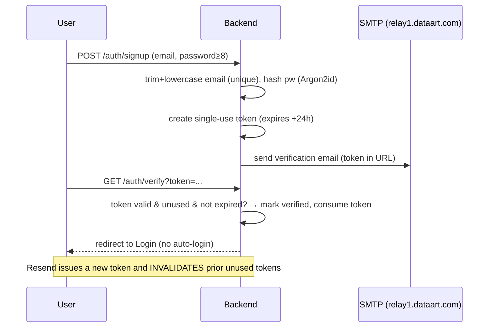
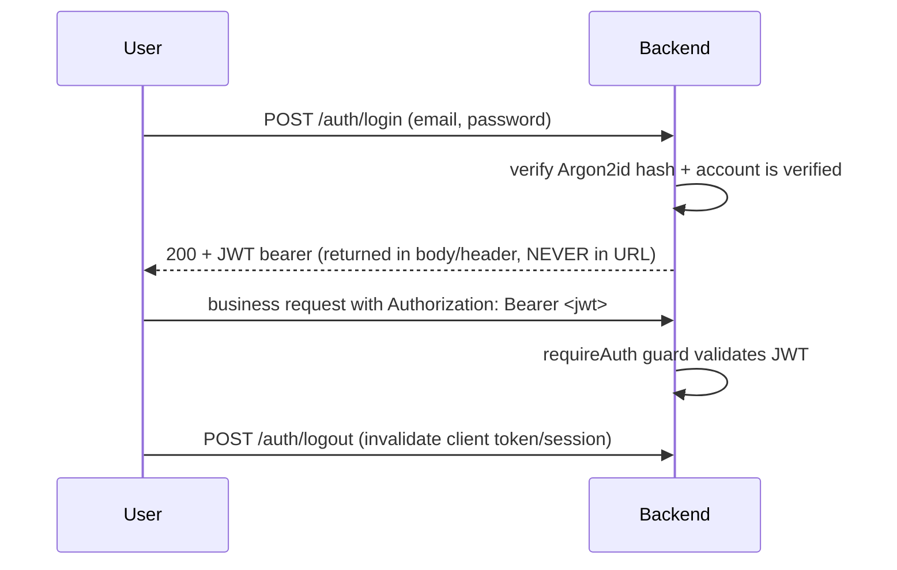

# Authentication Flow

- **Owner:** Architect (A1) · **Last updated:** YYYY-MM-DD · **Owning agent:** A5 · **Related ADRs:** <auth ADR if any>

## Signup + email verification

## Login / session

## Rules (REQUIREMENTS §3, §9)
- Passwords ≥8 chars, Argon2id, never plaintext. Verification tokens: 24h, single-use, resend invalidates prior.
- Unverified accounts blocked from business endpoints. Public: signup, login, verify, resend, health, static.
- Tokens never in URLs (except the single-use verification token). Verified by R2 + R4.
