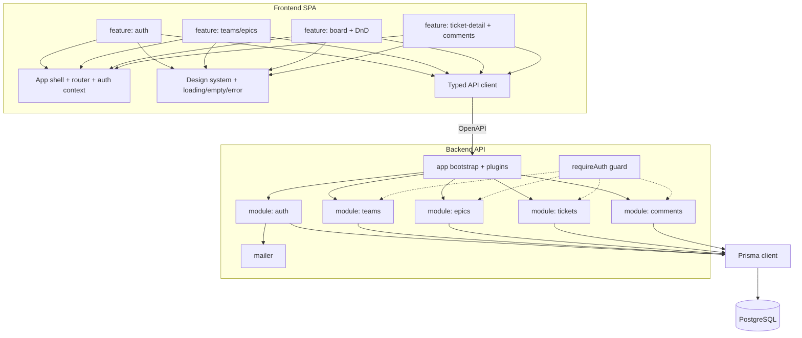

# Component Diagram

- **Owner:** Architect (A1) · **Last updated:** YYYY-MM-DD

## Component responsibilities
Summarize each component in one line and link its owning agent. Keep this diagram consistent with
`system-architecture.md` and the ownership map in `docs/agents/README.md`.
