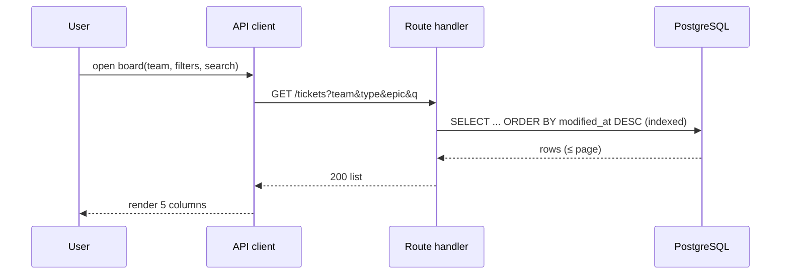

# Data Flow

- **Owner:** Architect (A1) · **Last updated:** YYYY-MM-DD

## Flow 1 — Create ticket (write path)
```mermaid
sequenceDiagram
  participant U as User (SPA)
  participant C as API client
  participant R as Route handler
  participant S as Ticket service
  participant P as Prisma
  participant D as PostgreSQL
  U->>C: submit ticket form
  C->>R: POST /tickets (bearer JWT)
  R->>R: authN guard + schema validation
  R->>S: createTicket(dto, userId)
  S->>S: validate enums + epic-belongs-to-team
  S->>P: insert (created_by, created_at UTC)
  P->>D: INSERT
  D-->>P: row
  S-->>R: ticket
  R-->>C: 201 + ticket (ISO-8601 UTC)
  C-->>U: render; board reflects new card
```

## Flow 2 — Board load (read path)


## Invariants enforced in-flow
- modified_at advances only on real field/state change (not no-op save, not comment add).
- Epic must belong to the ticket's team (create AND edit) else 400.
- All timestamps ISO-8601 UTC. Add further flows (comment add, drag-drop PATCH) as needed.
