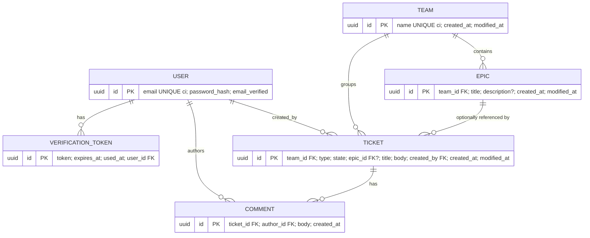

# Database Overview

- **Owner:** Architect (A1) · **Last updated:** YYYY-MM-DD · **Owning agent:** A3 · **Source of truth:** `backend/prisma/schema.prisma`

## Entity-relationship

## Constraints & integrity rules
| Rule | Mechanism |
|---|---|
| email & team name unique, case-insensitive | normalized column / citext + unique index |
| ticket.epic must be in ticket.team | server-side check (create + edit) → 400 |
| delete team with tickets/epics | FK RESTRICT → surfaced as 409 |
| delete epic referenced by tickets | FK RESTRICT → 409 |
| delete ticket | cascade delete its comments |
| enums (type, state) | DB/enum + server validation |
| timestamps | server-set UTC; modified_at only on real change |

## Migrations & seed policy
Automated via Prisma migrations on boot. Fresh DB = schema + migration metadata only; **no seed data**.
