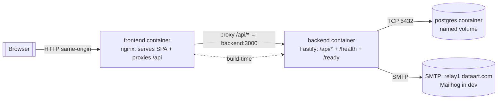

# Deployment Architecture

- **Owner:** Architect (A1) · **Last updated:** YYYY-MM-DD · **Owning agent for infra:** A2

## 1. Runtime topology (Docker Compose)

## 2. Services
| Service | Image/base | Ports | Depends on | Health |
|---|---|---|---|---|
| postgres | postgres:16 | 5432 (internal) | — | pg_isready |
| backend | node:20 (multi-stage) | 3000 | postgres (healthy) | GET /health |
| frontend | nginx (serves Vite build) | 80/5173 | backend | GET / |
| mailhog (dev only) | mailhog | 8025 UI | — | — |

## 3. Configuration
- All config via env (see `.env.example`): DB URL, JWT secret, SMTP host/port/creds, ports.
- **No secrets in VCS.** Real `.env` is gitignored.

## 4. Startup & data lifecycle
- `docker compose up --build` from repo root; backend waits for a healthy DB, runs migrations on boot.
- Fresh DB → schema + migration metadata only, **no seed data**. Data persists in a named volume across restarts.

## 5. Portability
Runs on clean Windows/macOS/Linux with only Docker Compose installed (REQUIREMENTS §2). Verified by R3 DoD audit.
