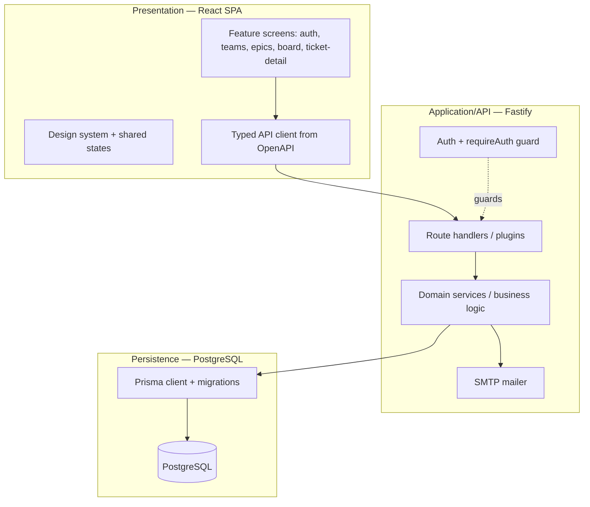

# System Architecture

- **Owner:** Architect (A1) · **Last updated:** YYYY-MM-DD · **Related ADRs:** ADR-0001

## 1. Logical tiers

## 2. Modules & boundaries
| Module | Tier | Responsibility | Owning agent |
|---|---|---|---|
| auth | app | signup/login/verify/resend, JWT, Argon2id | A5 |
| teams | app | team CRUD + 409 guards | A6 |
| epics | app | epic CRUD + team scoping | A15(BE)/A11(FE) |
| tickets | app | ticket domain, board query, filters | A7 |
| comments | app | add/list, immutability | A8 |
| shared contract | seam | OpenAPI + types | A1 |

## 3. Cross-cutting concerns
- **Validation:** server-side from OpenAPI schemas (client-side is advisory only).
- **Errors:** central handler → 400/401/403/404/409 with the shared error schema.
- **AuthN/Z:** JWT bearer; all business endpoints guarded; tokens never in URLs.
- **Config/secrets:** env-only; `.env.example`; nothing committed.

## 4. Dependency direction (Clean Architecture)
Domain/business logic depends on abstractions; infrastructure (Prisma/HTTP/SMTP) depends on the domain, never
the reverse. No import cycles. (Verified by R0.)

## 5. Contract-first seam
`contracts/openapi.yaml` + `packages/shared` are the single BE↔FE interface; both sides conform (verified by R1).
